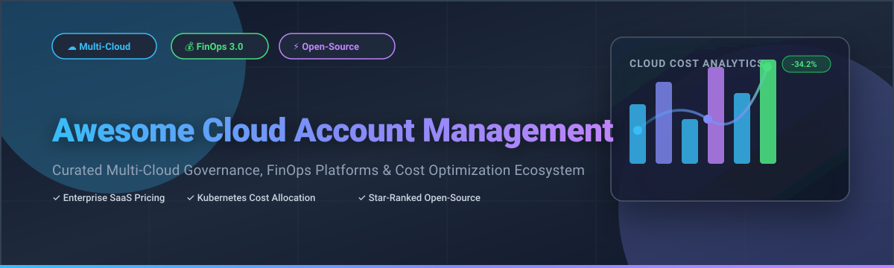

# Awesome-Cloud-Account-Management ☁️ 💰 🚀

  

  
  
  
  
  

---

## 🌟 Top Cloud Account Management & FinOps Ecosystem

**The Ultimate Curated Directory of Cloud Financial Management (FinOps) Platforms, Multi-Account Governance Tools & Open-Source Cost Optimization Engines** 📊 💡  

*Empowering Cloud Architects, DevOps Engineers, and Enterprise FinOps Teams to Gain Complete Cloud Cost Visibility, Automate Kubernetes Cost Allocation, Eliminate Waste, and Enforce Multi-Cloud Governance Across AWS, Azure, GCP, and On-Premises Infrastructure.* 🛡️ 🌐

**Last updated: October 2026** 📅

---

### 📌 SEO & Market Overview

Welcome to the definitive community guide for **cloud account management platforms**, **FinOps cost optimization software**, and **multi-cloud governance frameworks**. As organizations scale their infrastructure across Amazon Web Services (AWS), Microsoft Azure, Google Cloud Platform (GCP), and Kubernetes clusters, managing cloud spend and governance becomes a critical business operational imperative. 

This curated directory provides side-by-side comparative insights covering both enterprise-grade commercial platforms (such as *AWS Account Management*, *Azure Cost Management*, *Cloudability*, *Spot by NetApp*, and *Vantage*) and privacy-preserving, self-hostable open-source projects (such as *Infracost*, *Steampipe*, *OpenCost*, *Cloud Custodian*, and *OptScale*).

---

## 📑 Table of Contents 🧭

- [🏢 SaaS & Commercial Platforms](#-saas--commercial-platforms) 📈
- [🔓 Open-Source GitHub Projects](#-open-source-github-projects) 🔓
- [🛠️ How to Contribute](#%EF%B8%8F-how-to-contribute) 🤝
- [🤝 Support & Sponsorship](#-support--sponsorship) ☕
- [📊 Star History](#-star-history) 📈
- [⚠️ Disclaimer](#%EF%B8%8F-disclaimer) ℹ️

---

## 🏢 SaaS / Commercial Platforms 📈

> [!NOTE]
> **Market Insights & Fragmentation:**  
> The global Cloud Financial Management & FinOps Market size is estimated at **$22.5 Billion** (2026) and is projected to reach **$38.4 Billion by 2030**. The sector is **moderately fragmented**: hyper-scaler native governance tools (AWS, Azure, GCP) command the baseline tier, while specialized third-party SaaS vendors and cloud management platforms compete fiercely for multi-cloud enterprise observability and automated waste remediation.

*Sorted by Company Revenue / Enterprise Valuation (Descending)* 🏆

| SaaS / Commercial Platform | Company / Owner 🏢 | Valuation / Company Revenue 💵 | Standard Edition Starting Price 💰 | Free Tier / Free Trial Limits 🎁 | Key Features & FinOps Description 📝 |
| :--- | :--- | :--- | :--- | :--- | :--- |
| **[Azure Cost Management](https://azure.microsoft.com/en-us/products/cost-management/)** 🔷 | Microsoft | **~$3.90 Trillion** (Market Cap) | **Free native tool** (0% markup on Azure spend) | **Free forever**; $200 credits for 30-day trial | **Azure-native cost tracking & governance** — Direct access to usage and charges files by account type (EA, MCA, PAYG), automated budget alerts, anomaly detection, and export pipelines. |
| **[AWS Account Management](https://aws.amazon.com/account/)** ☁️ | Amazon | **~$2.00 Trillion** (Market Cap) | **Free native tool** (0% markup on AWS spend) | **Free forever**; AWS Free Tier includes 100+ services | **AWS-native account governance & billing** — Consolidated billing, Organizations OU governance, Savings Plans sharing, Cost Categories, and Billing Conductor discount group management. |
| **[Google Cloud Resource Manager & Cost Management](https://cloud.google.com/resource-manager)** 🌐 | Google (Alphabet) | **~$2.00 Trillion** (Market Cap) | **Free native tool** (0% markup on GCP spend) | **Free forever**; $300 credits for 90-day trial | **GCP-native resource hierarchy & optimization** — Hierarchical organization/folder/project IAM control, automated Recommender API for idle resource detection, CUD recommendations, and bigquery billing export. |
| **[Cloudability](https://www.apptio.com/products/cloudability/)** 💰 | IBM (Apptio) | **~$200 Billion** (Parent IBM Market Cap) | **$2,500/month** (Starter tier for up to $1M managed spend) | **Free Trial: 14-day full feature trial** (Up to 3 cloud accounts) | **Enterprise percentage-of-spend FinOps platform** — Multi-cloud cost allocation, tag anomaly detection, commitment management, and RI/Savings Plan optimization. |
| **[IBM Turbonomic](https://www.ibm.com/products/turbonomic)** ⚙️ | IBM | **~$200 Billion** (Market Cap) | **$225/year** (Standard Datacenter) or **% of cloud spend** (Public Cloud) | **Free Trial: 30-day unlimited evaluation** | **AI-driven application resource management** — Full-stack continuous automation across public cloud (AWS, Azure, GCP) and Kubernetes (EKS, AKS, GKE) to guarantee performance while eliminating wasted spend. |
| **[Spot by NetApp](https://spot.io/)** 🟢 | NetApp | **~$20 Billion** (Market Cap) | **$13,500/year** (Starting tier; median buyer ~$109K/yr) | **Free Tier: Up to 20 managed instances**; 14-day free trial | **Automated infrastructure optimization** — Continuous workload rightsizing, automated spot instance orchestration (Elastigroup), and container cost optimization (Ocean). |
| **[CloudHealth](https://www.cloudhealthtech.com/)** 🏥 | Broadcom (VMware) | **~$60 Billion** (Parent Broadcom Valuation) | **Custom quote-based** (Typically 1.5% - 3% of monthly cloud spend) | **Free Trial: 14-day free trial** | **Multi-cloud governance & security posture** — Tag-based cost allocation, rightsizing recommendations, custom pricing rules, policy enforcement, and multi-cloud financial reporting. |
| **[Flexera One (RightScale)](https://www.flexera.com/)** 📊 | Flexera (Thoma Bravo) | **~$2.90 Billion** (Acquisition Valuation / ~$290M Rev) | **Custom enterprise pricing** (Quote-based) | **Free Demo / Trial upon request** (Contact sales) | **Hybrid IT asset & cloud cost management** — Cloud Pricing Service API accessing 100,000+ instance price points across AWS, Azure, GCP, and hybrid datacenters. |
| **[Morpheus Data](https://morpheusdata.com/)** 🔮 | HPE (Morpheus Data) | **~$20 Million+ Revenue** (Acquired by HPE) | **Custom quote-based** per socket / managed workload | **Free Demo & 30-day evaluation license** | **Hybrid cloud management & orchestration** — Self-service provisioning, custom cost metering, dynamic sizing plans, and multi-cloud billing reports (CSV/JSON). |
| **[Vantage](https://vantage.sh/)** ⚡ | Vantage | **~$25 Million Funding** (Venture Backed) | **$30/month** (Pro tier for up to $7,500 tracked spend) | **Free Tier: Starter tier up to $2,500/mo tracked spend** (3 user seats) | **Developer-friendly cloud cost platform** — Modern multi-cloud visibility (AWS, Azure, GCP, Snowflake, Datadog), automated Autopilot cost savings, and financial dashboards. |

---

## 🔓 Open-Source GitHub Projects 🌟

*Sorted by GitHub_Stars_Count (Descending)* 🏆

- **[Infracost](https://github.com/infracost/infracost)**   
  **Shift-left cloud cost estimates for Terraform in Pull Requests**, Apache-2.0 licensed. **12,551+ stars** 🌟. Displays cost impacts directly in pull requests before infrastructure is deployed. Supports AWS, Azure, GCP, and 1,000+ Terraform resources to prevent expensive cloud regressions in CI/CD pipelines. 💸 ⚡

- **[Steampipe](https://github.com/turbot/steampipe)**   
  **Select & query cloud APIs with SQL**, AGPL-3.0 licensed. **7,971+ stars** 🌟. Zero-ETL engine to query AWS, Azure, GCP, Kubernetes, and 100+ services using standard SQL. Easily build custom FinOps dashboards, audit untagged assets, and detect unattached storage volumes. 🔗 📊

- **[OpenCost](https://github.com/opencost/opencost)**   
  **The open-source vendor-neutral cost monitoring engine for Kubernetes**, Apache-2.0 licensed (CNCF Sandbox). **6,766+ stars** 🌟. Real-time cost allocation by cluster, namespace, deployment, or pod. Integrates with cloud billing APIs for live AWS, Azure, and GCP pricing, includes carbon emission tracking, and provides a built-in MCP server for AI agent queries. 🎯 ☸️

- **[CloudQuery](https://github.com/cloudquery/cloudquery)**   
  **High-performance cloud asset inventory & data integration framework**, MPL-2.0 licensed. **6,535+ stars** 🌟. Extracts multi-cloud configurations into PostgreSQL, ClickHouse, or BigQuery. Enables custom FinOps data engineering, asset lineage tracking, and multi-cloud infrastructure analytics. 📦 🐘

- **[Cloud Custodian](https://github.com/cloud-custodian/cloud-custodian)**   
  **Stateless YAML-based rules engine for cloud governance & cost optimization**, Apache-2.0 licensed (CNCF Incubation). **6,079+ stars** 🌟. Automated policy enforcement across AWS, Azure, and GCP. Automatically cleans up idle resources, stops off-hours dev instances, and enforces resource tagging. 🛡️ 🤖

- **[Komiser](https://github.com/tailwarden/komiser)**   
  **Multi-cloud asset inventory and cost visibility dashboard**, Apache-2.0 licensed. **4,142+ stars** 🌟. Interactive dashboard for AWS, Azure, GCP, DigitalOcean, and Kubernetes. Highlights security risks, unattached storage volumes, and untagged resources across environments. 🔍 🌐

- **[OptScale](https://github.com/hystax/optscale)**   
  **Open-source FinOps & ML cost optimization platform**, Apache-2.0 licensed. **2,200+ stars** 🌟. Multi-cloud cost tracking (AWS, Azure, GCP, Alibaba Cloud) and K8s. Features automated waste recommendations, ML infrastructure spending insights, and budget limit notifications. 🧠 💡

- **[Azure Cost CLI](https://github.com/mivano/azure-cost-cli)**   
  **Command-line interface for Azure Cost Management**, MIT licensed. **1,121+ stars** 🌟. Query Azure spend directly from your terminal with daily/monthly breakdowns, resource group filtering, budget tracking, and markdown output. 🔵 🖥️

- **[Cloud Carbon Footprint](https://github.com/cloud-carbon-footprint/cloud-carbon-footprint)**   
  **Green FinOps tool to measure and visualize cloud carbon emissions**, Apache-2.0 licensed. **1,053+ stars** 🌟. Translates cloud spend and energy usage across AWS, Azure, and GCP into estimated greenhouse gas emissions. 🌱 🌍

- **[Kubecost Helm Chart Core](https://github.com/kubecost/cost-analyzer-helm-chart)**   
  **Kubernetes cost monitoring and governance chart**, Apache-2.0 licensed. **675+ stars** 🌟. Deployment chart for Kubecost's Kubernetes cost management system built on top of OpenCost core. 📊 ☸️

- **[Microsoft FinOps Toolkit](https://github.com/microsoft/finops-toolkit)**   
  **Open-source starter kits, PowerBI templates, and automation for FinOps on Azure**, MIT licensed. **609+ stars** 🌟. Official Microsoft toolkit featuring FOCUS spec data ingestion templates, cost governance policy engines, and Power BI reporting dashboards. 🔷 🛠️

- **[FinOps Foundation Landscape](https://github.com/finopsfoundation/foundation)**   
  **Community-driven FinOps framework and specification repository**, open-source. **23+ stars** 🌟. Maintains the open-source FinOps framework specs, practitioner capabilities guides, and FOCUS (FinOps Open Cost and Usage Specification) standard schema docs. 🗺️ 📚

---

## 🛠️ How to Contribute 🤝

Contributions are welcome! Follow these simple steps to add new cloud account management platforms, FinOps tools, or open-source software:

1. 🍴 **Fork** the repository.
2. 📝 **Add or update** entries in `README.md` keeping the Markdown formatting, tables, and emoji decorations intact.
3. 🔗 Include official links, exact verified GitHub_Stars_Counts, licenses, and specific pricing tier details.
4. 🚀 Submit a **Pull Request** with a concise description of your additions.

---

## 🤝 Support & Sponsorship ☕

Thank you for using and exploring **Awesome Cloud Account Management**! If this repository has helped your team eliminate cloud waste, optimize Kubernetes cluster allocation, and govern multi-cloud accounts, please consider supporting the project:

- ⭐ **Star** this repository on GitHub to increase visibility!
- 🔀 **Fork** and share it with fellow FinOps practitioners, Cloud Architects, and DevOps engineers.
- ☕ **Buy Me a Coffee / Sponsor**: Support ongoing open-source curation via the [GitHub Sponsor Dashboard](https://github.com/sponsors/ishandutta2007).

---

## 📊 Star History

---

## ⚠️ Disclaimer ℹ️

- This directory is a **community-curated list** provided for educational purposes. ℹ️
- **Cloudability pricing** starts around $2,500/mo and includes percentage-of-spend overage clauses ($1,930 to $4,410 per unit) which can scale costs alongside your cloud bill. 📈
- **CloudHealth and Flexera pricing models** rely on custom enterprise quotes. While they deliver deep visibility, resource rightsizing and commitment automation often require engineering execution. 🛠️
- **Open-source projects** (such as OpenCost, Infracost, and Cloud Custodian) offer complete data privacy and zero licensing fees, but require self-hosted maintenance and integration. Always verify cost numbers against native AWS, Azure, and GCP billing dashboards. 💰

---

  <b>Made with ❤️ for Cloud Architects, FinOps Engineers, and Open-Source Advocates worldwide.</b>

